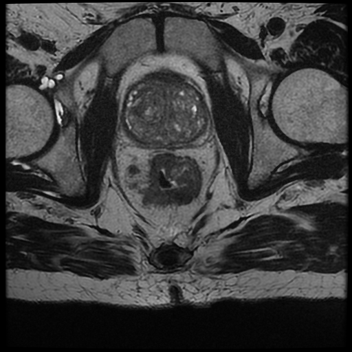

| **Author**  | **Project** |  **Build Status** | **License** | **Code Quality** | **Coverage** |
|:------------:|:-----------:|:-----------------:|:-----------:|:----------------:|:------------:|
| [**G. Filitto**](https://github.com/giuseppefilitto) | **MRI colorectal cancer segmentation** | **Linux** :  | | **Codacy** : [](https://www.codacy.com/gh/giuseppefilitto/img-segm/dashboard?utm_source=github.com&amp;utm_medium=referral&amp;utm_content=giuseppefilitto/img-segm&amp;utm_campaign=Badge_Grade) <br/> **Codebeat** : [](https://codebeat.co/projects/github-com-giuseppefilitto-img-segm-main) | [](https://codecov.io/gh/giuseppefilitto/img-segm) |


[](https://github.com/giuseppefilitto/img-segm/stargazers)
[](https://github.com/giuseppegilitto/img-segm/watchers)


# img-segm

This package allows to segment cancer regions on T2-weighted Magnetic Resonance Images (MRI) of patients affected by colorectal cancer.
The segmentation approach is based on Convolutional Neural Networks (CNNs) like U-Net.
This package provides a series of modules and scripts to visualize, pre-process the DICOM files and to train a U-Net model.

1. [Overview](#Overview)
2. [Contents](#Contents)
3. [Prerequisites](#Prerequisites)
4. [Installation](#Installation)
5. [Usage](#Usage)
6. [License](#License)
7. [Author](#Author)
8. [Citation](#Citation)


## Overview

Colorectal cancer is a malignant neoplasm of the large intestine resulting from the uncontrolled proliferation of one of the cells making up the colorectal tract. 
In Western countries, colorectal cancer is the second largest malignant tumor after that of the breast in women and the third after that of the lung and prostate in men. 
Risk factors for this kind of cancer include colon polyps, long-standing ulcerative colitis, diabetes II and genetic history (HNPCC or Lynch syndrome). 
In order to get information about diagnosis, therapy evaluation on colorectal cancer, radiomic analysis can be performed on radiological images through the application of dedicated radiomic algorithms.

In this scenario, the correct and fast identification of the cancer regions is a
fundamental task. 
Up to now this task is performed using manual or
semi-automatic techniques, which are time-consuming and
subjected to the operator expertise.

This project provides an automatic pipeline for the segmentation of
cancer areas on T2-weighted Magnetic Resonance Images of patient affected by colorectal cancer.
The segmentation is achieved with a Convolutional Neural Network like U-Net.


<p float="center">    
   
   

 </p>

**Example of segmentation** . **Left:** Original image: **Right** original image with identified tumor area.

## Contents

img-segm is composed of a series of modules contained in [MRIsegm](https://github.com/giuseppefilitto/img-segm/tree/main/MRIsegm) and scripts in [utils](https://github.com/giuseppefilitto/img-segm/tree/main/utils):
- modules allows to load, visualize, processing the DICOM series and to train a [U-Net](https://github.com/giuseppefilitto/img-segm/blob/main/extras/U-Net%20arch.jpeg) model. 
- scripts provide a fast way to handle DICOM series and ROI from command line.

For a better description of each module:

| **Module**| **Description**|
|:---------:|:--------------:|
| utils | methods to load and visualize the DICOM series and the relative Region Of Interest (ROI)|
| processing | methods to perform operations such as denoising, resizing, predict the images |
| models | contains the implementation of a U-net model|
| datagenerators | contains a  method to generate data for training the model |
| metrics | contains useful metrics for training the model |
|losses | 	contains useful losses for training the model |
|graphics| methods to display the predictions |

_notes_:

* It is also possible to use models, metrics and losses from the [segmentation-models](https://github.com/qubvel/segmentation_models) library.


For a better description of each script:

| **Script** | **Description** |
|:----------:|:---------------:|
| dcmsorter | move and sort DICOM files from nested dirs like ```patientID/EXAMINATION/DIRECTORY1/DIRECTORY2``` to ```patientID/EXAMINATION```					 																																				|
| dcm2img| convert DICOM series to .png images																																												|
| roimanager | show the ROI saved as .roi over the images|


For the usage of each script please refer to the [documentation](https://github.com/giuseppefilitto/img-segm/tree/main/utils).
## Pre-requisites

Supported python: 

First of all ensure to have the right python version installed.

This project use Tensorflow, opencv-python, numpy: see the
[requirements](https://github.com/giuseppefilitto/img-segm/blob/main/requirements.txt) for more information.

> :warning: Tensorflow v2.5 requires the minimum Python version to be  3.6!


## Installation
First, clone the git repository and change directory:

```bash
git clone https://github.com/giuseppefilitto/img-segm.git
cd img-segm
```

Then, pip-install the requirements and run the setup script:
```bash
pip install -r requirements.txt
```
> :warning: Apple Silicon: ensure to have installed a proper [Conda env](https://github.com/conda-forge/miniforge), then install tensorflow as explained [here](https://developer.apple.com/metal/tensorflow-plugin/). Finally, install one by one the remaining dependencies using conda (if available) or pip.
```bash
python setup.py install
```
### Testing

Testing routines use ```PyTest``` and ```Hypothesis``` packages. 
A full set of test is provided in [testing](https://github.com/giuseppefilitto/img-segm/blob/master/testing) directory.
You can run the full list of test with:

```bash
python -m pytest
```
## Usage
Once you have installed it, you can start to segment the images directly from your bash.
The input **dir** is a DICOM series, pass the path to the directory containing
the series files.
Please ensure that the folder contains only one series.
If the directory is a subfolder of more than one directory, the script will find automatically the subfolder containing the DICOM series.

### Quick Start

```bash
   python -m MRIsegm --dir='/path/to/input/series/'  
```

_where_:
* ```--dir ``` is the path of the directory containing the DICOM series (required).


#### Options

#### ```--model``` 
 Name of the model's weights saved in the [``` weights```](https://github.com/giuseppefilitto/img-segm/tree/main/data/models/weights) dir.

 ```bash
   python -m MRIsegm --dir='/path/to/input/series/' --model='model_name'
```

 _notes_:
 * ``` model_name``` set as default:```efficientnetb0_256_256_BTC=8_alpha3_OPT=Adam_LOSS=DiceBCEloss```
 * Remember to specify the name without```_weights.h5```
 * you can also use your own model's weight saving the weights in the [``` weights```](https://github.com/giuseppefilitto/img-segm/tree/main/data/models/weights) dir as ``` model_name_weights.h5```. 
>:warning: You need to save also the architecture  as ``` model_name.json``` file in the same dir.

#### ```--mask``` 

When enabled plot the segmented mask, between 0 and 1, of each slice
```bash
   python -m MRIsegm --dir='/path/to/input/series/'  --mask
```


#### ``` --density``` 

When enabled plot the the probability map between 0 and 1 of each slice over the original image
```bash
   python -m MRIsegm --dir='/path/to/input/series/'  --density
```


#### ``` --3D```  

When enabled plot the a 3D mesh plot of the segmented areas
```bash
   python -m MRIsegm --dir='/path/to/input/series/'  --3D
```


### Examples

Several examples are available under the [notebooks](https://github.com/giuseppefilitto/img-segm/blob/master/notebooks) dir.

For each purpose:

| **Purpose** | **Example** |
|:----------:|:---------------:|
| load, visualize DICOM series  |  [DicomExplorer](https://github.com/giuseppefilitto/img-segm/blob/main/notebooks/DicomExplorer.ipynb)   |
| perform Image processing operation  |  [ImageProcessing](https://github.com/giuseppefilitto/img-segm/blob/main/notebooks/ImageProcessing.ipynb)  |
|   Pre-process the images for model's training |   [Pre-processing](https://github.com/giuseppefilitto/img-segm/blob/main/notebooks/Pre-processing.ipynb)  |
|  train a U-net model |    [UNet-Segmentation](https://github.com/giuseppefilitto/img-segm/blob/main/notebooks/UNet-Segmentation.ipynb) |
|       train a model from [segmentation-models](https://github.com/qubvel/segmentation_models)|  [SM-Segmentation](https://github.com/giuseppefilitto/img-segm/blob/main/notebooks/SM-Segmentation.ipynb)   |
|    Display the predictions  |      [Predictions](https://github.com/giuseppefilitto/img-segm/blob/main/notebooks/Predictions.ipynb)   |
|    Save the predicted image   |     [Store_Predictions](https://github.com/giuseppefilitto/img-segm/blob/main/notebooks/Store_predictions.ipynb)     |
|   Convert model to model's weights   |      [ConverterToWeights](https://github.com/giuseppefilitto/img-segm/blob/main/notebooks/ConverterToWeights.ipynb) |
| plot 3D mesh| [3D-mesh](https://github.com/giuseppefilitto/img-segm/blob/main/notebooks/3D-mesh.ipynb)  | 


__features extraction (extras)__:
> :warning: WORK IN PROGRESS! Require [SimpleITK](https://simpleitk.readthedocs.io/en/master/gettingStarted.html#python-binary-files) and [pyradiomics](https://pyradiomics.readthedocs.io/en/latest/installation.html). Please ensure to have them installed.


| **Purpose** | **Example** |
|:----------:|:---------------:|
|  Feature Extraction   |    [FeaturesExtraction](https://github.com/giuseppefilitto/img-segm/blob/main/notebooks/FeaturesExtraction.ipynb) |
|   Features Clustering      |  [Features Clustering](https://github.com/giuseppefilitto/img-segm/blob/main/notebooks/FeaturesClustering.ipynb) |
|   Write .dcm files   |    [Writedicom](https://github.com/giuseppefilitto/img-segm/blob/main/notebooks/Writedicom.ipynb)   |
|    Write .nrrd files     |   [sitkvolumeR](https://github.com/giuseppefilitto/img-segm/blob/main/notebooks/sitkvolumeR.ipynb)   |
## License

This package is licensed under the MIT "Expat" License.


## Author
*  **Giuseppe Filitto** [git](https://github.com/giuseppefilitto)

### Citation

If you have found `img-segm` helpful in your research, please
consider citing this project

```BibTeX
@misc{MRI colorectal cancer segmentation,
  author = {Filitto, Giuseppe},
  title = {MRI colorectal cancer segmentation},
  year = {2021},
  publisher = {GitHub},
  howpublished = {\url{https://github.com/giuseppefilitto/img-segm}},
}
```
